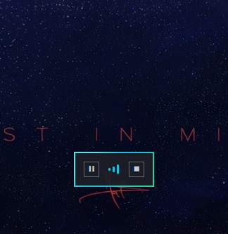
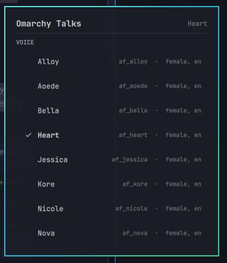

# Omarchy Talks

Highlight text anywhere in Omarchy, press **Super + Alt + R**, and hear it read aloud locally.

Omarchy Talks is a native read-aloud tool for Omarchy. It captures the Wayland primary selection, sends it to a locally managed VoiceBox Kokoro runtime, and presents lightweight playback controls that fit the desktop.

## Features

- Read highlighted text with **Super + Alt + R**; stop with **Super + Alt + Shift + R**.
- Pause, resume, replace, or stop active speech from the native playback controls.
- Choose and persist a Kokoro voice in **Setup → Omarchy Talks**.
- Keep speech local through a user-owned, pinned VoiceBox runtime.
- Use `omarchy-talks doctor` and JSON CLI commands for clear runtime diagnostics.



## v0.1.0

v0.1.0 is the initial community release of Omarchy Talks.

## Tested on / support

This release is tested on **Omarchy 4.0.3** using the **English Kokoro CPU** path. It does not claim support for other operating systems, GPU/CUDA paths, or VoiceBox languages that require phonemizers not installed by this project. VoiceBox may list additional presets; that does not make their runtime paths supported here.

## Install

Prerequisites are a normal Omarchy desktop with `git`, `uv`, `pw-play`, `wl-paste`, `systemctl --user`, and Omarchy plugin tools available on `PATH`. Omarchy does not currently include `uv` on a pristine installation; install it first with Astral's official user-scoped method at <https://docs.astral.sh/uv/getting-started/installation/>. The installer does not use `sudo` or install system packages.

```bash
git clone https://github.com/Zerolxgic/Omarchy-Talks.git
cd Omarchy-Talks
scripts/install-user-runtime.sh --enable
omarchy-talks doctor
```

Installation creates or uses only user-owned locations:

- executable managed by `uv tool`;
- configuration: `~/.config/omarchy-talks/config.toml`;
- VoiceBox source, virtual environment, and profile data: `~/.local/share/omarchy-talks/`;
- user unit: `~/.config/systemd/user/omarchy-talks-voicebox.service`;
- Omarchy plugins: `~/.config/omarchy/plugins/omarchy-talks.controls` and `~/.config/omarchy/plugins/omarchy-talks.settings`.

The service listens on `127.0.0.1:17493` and uses the pinned revision recorded in [`VOICEBOX_PIN`](VOICEBOX_PIN). The installer deliberately resolves a Kokoro-only CPU dependency path; it does not install VoiceBox's all-engine CUDA/NVIDIA stack.

## Use

Select text in any Wayland application and press **Super + Alt + R**. A new read replaces the active read. The transient playback surface can pause/resume or stop speech, and **Setup → Omarchy Talks** changes the voice for subsequent reads.



```bash
omarchy-talks speak-selection
omarchy-talks pause
omarchy-talks resume
omarchy-talks stop
omarchy-talks status --json
omarchy-talks voices --json
omarchy-talks voice set af_bella
omarchy-talks doctor
```

`speak-selection` reads only the Wayland primary selection. It never falls back to the ordinary clipboard.

## Demo


https://github.com/user-attachments/assets/c6a0da2f-f216-4478-a3df-ae53a6ecd257


[Watch the v0.1.0 demo](docs/media/omarchy-talks-v0.1-demo.mp4) to see selected-text read-aloud, native playback controls, and theme integration.

## Diagnostics

Run `omarchy-talks doctor` before reporting a problem. Inspect the service with:

```bash
systemctl --user status omarchy-talks-voicebox.service
journalctl --user -u omarchy-talks-voicebox.service
```

Public unit tests can run without a graphical session:

```bash
uv run python -m unittest discover -s tests -v
omarchy-plugin-validate plugins/omarchy-talks.controls
omarchy-plugin-validate plugins/omarchy-talks.settings
```

## Uninstall and purge

```bash
scripts/uninstall-user-runtime.sh
```

Normal uninstall removes the service and integration links while retaining `~/.config/omarchy-talks` and `~/.local/share/omarchy-talks` (configuration, profiles, VoiceBox source, and environment).

On a disposable installation, remove those retained OT-owned paths separately with:

```bash
scripts/uninstall-user-runtime.sh --purge
```

## Limitations

- Audio intelligibility and desktop appearance require human acceptance on a target desktop; automated checks alone do not establish them.
- Only the tested English Kokoro CPU path is supported.
- VoiceBox work may continue briefly after cancellation is accepted.
- The reader accepts complete PCM WAV artifacts only.

## License and third parties

Omarchy Talks is MIT licensed. It does not relicense VoiceBox, Kokoro, models, PyTorch, or any other dependency. See [`THIRD_PARTY_NOTICES.md`](THIRD_PARTY_NOTICES.md) for the relevant boundaries.
